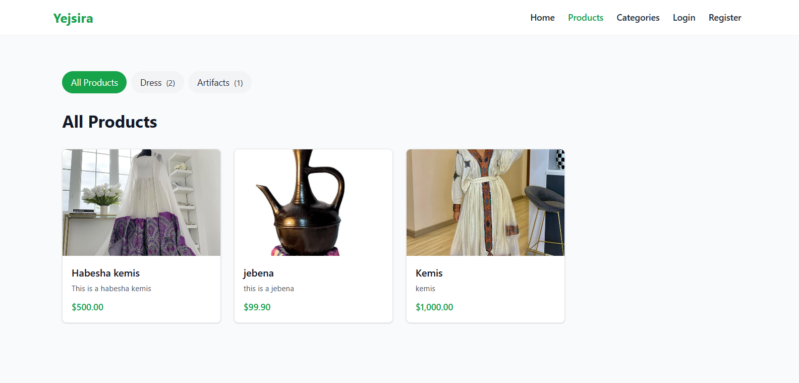
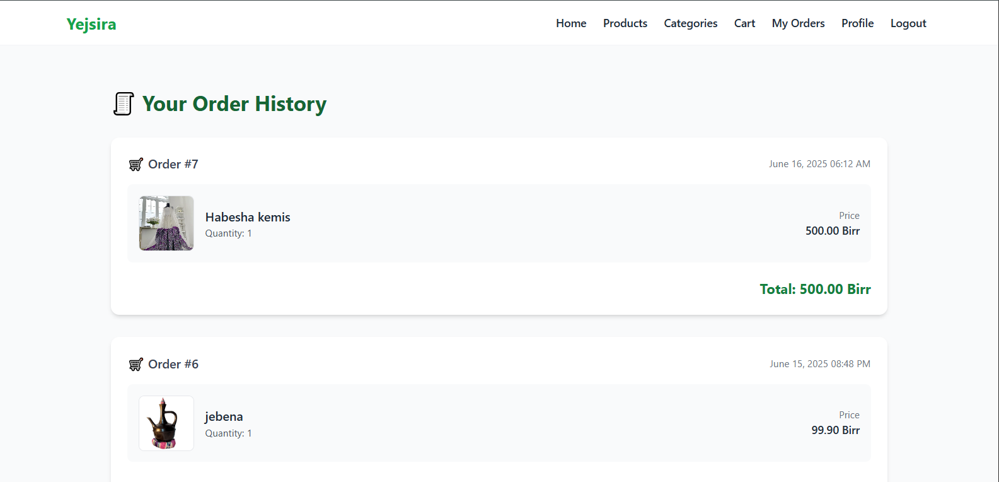
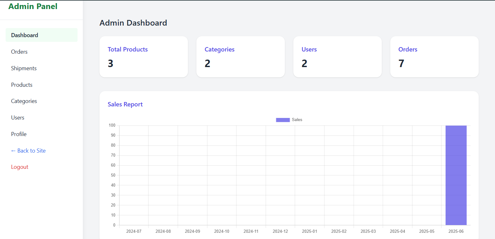

# Yejsira Shopping

Yejsira Shopping is a Laravel-based project for managing a simple shopping platform. It follows the **MVC (Model-View-Controller)** architecture, separating business logic, UI rendering, and data access for clean and maintainable code.

## 🚀 Features

- Product management with form input
- Simple UI with Blade templates
- Admin dashboard (basic)
- Handles file uploads (e.g. product images)
- Clean MVC separation:
  - **Models** handle database interaction
  - **Views** render UI with Blade templates
  - **Controllers** manage logic and request handling

 ## 📸 Screenshots

### Products

### User order history

### Admin Dashboard

